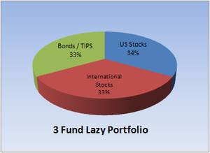

# A Practical Guide to Investing

### *12/20/2024*

*Targeted for younger professionals looking to start their investing.
(huge thanks to [Alan Liu](http://alanliu.dev) for the lesson on investing)*

## Understanding Risk, Return, and the Efficient Frontier

### Risk and Return Trade-Off

When you invest, you accept some level of risk in hopes of earning a higher return. In general, taking on more risk offers the potential for higher returns—but only up to a point.

### The **Efficient Frontier**

Imagine a graph:

- **X-axis:** Risk (how much prices can swing).
- **Y-axis:** Expected Return (how much money you might earn).

If you plot all possible investment mixes, you get a curve called the “efficient frontier.”

- You cannot get returns above this curve given your level of risk.
- If you’re below the curve, you are taking more risk than necessary for the same return (you don’t want that).

### Bottom Line: **Passive Investing**

Aim for a portfolio on or near the efficient frontier. Most individuals, especially beginners, can achieve this through a passive investment strategy.

Recommended By:

- Warren Buffett
- Robert Shiller
…and a wide range of financial experts.

One popular passive approach is the [Bogleheads® philosophy](https://www.bogleheads.org/wiki/Bogleheads%C2%AE_investment_philosophy), which emphasizes low-cost index funds and simple, steady strategies.

---

## Compound Interest: Let Time Work for You

### **Rule of 72**

- 72 ÷ your annual return ≈ years to double your money.

For example, at 9% return per year, your money doubles about every 8 years. Over decades, this compounding growth is huge, especially in tax-advantaged accounts where you don’t pay yearly taxes on gains.

---

## Choosing Your Investments: Stocks vs. Bonds

- **Stocks:** Historically return about 7–9% per year over the long term, but their value can fluctuate greatly in the short term.
- **Bonds:** Historically return about 4–5% per year. They’re more stable but grow more slowly than stocks.

### Why It Matters

- When you’re young or saving for long-term goals (like retirement), lean more toward stocks for higher growth. (think about the Rule of 72)
- When you’re close to a big purchase (like a house) or retirement, add more bonds for stability.

### Stocks vs. International Stocks

The exact split between U.S. and international stocks isn’t critical for beginners. Many just pick a broadly diversified U.S. stock fund and possibly add an international fund later.

---

## Avoid Timing the Market

Trying to guess when to buy or sell based on market predictions almost never works, even for experts. Instead:

- Invest regularly.
- **Only change your investments when your life situation changes** (e.g., getting married, having kids, buying a home), not because of daily market ups and downs.

---

## Tax Basics

Taxes impact not only your income but also your investment returns. Understanding different account types and their tax implications is crucial for maximizing your savings.

### High Level

- **Taxable Brokerage Accounts:** Pay taxes on gains, dividends, and interest each year.
- **Tax-Advantaged Accounts (401(k)s and IRAs):** Offer tax-free growth or allow you to defer taxes until withdrawal.

### Taxable Brokerage Accounts

- **What They Are:** Regular investment accounts without special tax benefits.
- **Taxes:**
  - **Dividends and Interest:** Taxed annually.
  - **Capital Gains:**
    - **Long-term (over 1 year):** 10–20% tax rate.
    - **Short-term (under 1 year):** Taxed as ordinary income, up to ~30%.
  - **Losses:** Can offset gains to reduce your tax bill.

### Tax-Advantaged Accounts

#### Employer Plans (401(k))

- **Traditional 401(k):** Contributions are pre-tax; taxes are paid on withdrawals.
- **Roth 401(k):** Contributions are after-tax; withdrawals are tax-free if rules are met.

#### Individual Retirement Accounts (IRAs)

- **Traditional IRA:** Pre-tax contributions (subject to income limits); grow tax-deferred; taxed upon withdrawal.
- **Roth IRA:** After-tax contributions; grow tax-free; qualified withdrawals are tax-free.

### Why Roth Might Be Great When You’re Young

- Contributions are taxed now, allowing your investments to grow and be withdrawn tax-free later, which benefits from long-term growth.
- Holding bonds or other income-producing assets in a Roth avoids taxes on dividends and interest.

---

## Increasing Roth Contributions: **Backdoor** & **Mega Backdoor**

### Roth Limits

Roth IRAs have two kinds of limits:

1. **Income limits:** High earners can be blocked from contributing directly to a Roth IRA.
2. **Contribution limits:** There’s a yearly maximum you can put into an IRA (often around $6,500–$7,000, check current IRS rules), and a maximum you can put into your 401(k).

### **Backdoor Roth** (Using an IRA)

- **Who It Helps:** High earners who can’t contribute directly to a Roth IRA due to income limits.
- **How It Works:**
    1. Contribute money to a Traditional IRA (often non-deductible if you’re above income limits).
    2. Convert that Traditional IRA contribution into a Roth IRA.

This effectively bypasses the income limit and gets money into a Roth every year (around $6,500–$7,000).

**Important:** *Make sure you don’t have existing pre-tax money in a Traditional IRA. If you do, consult a tax professional because conversions can become complicated.*

### **Mega Backdoor Roth** (Using a 401(k))

- **Who It Helps:** Those who have a 401(k) plan allowing after-tax contributions beyond the normal limits.
- **How It Works:**
    1. Max out your standard 401(k) contributions (pre-tax or Roth).
    2. Add additional after-tax contributions into your 401(k) if allowed.
    3. Convert these after-tax contributions into Roth (either inside the 401(k) or rolling into a Roth IRA).

This can increase your Roth contributions from around $20,000 per year to potentially $50,000–$60,000 or more (check current limits).

### In Short

- **Backdoor Roth:** Individual-level, using IRAs to get around income limits.
- **Mega Backdoor Roth:** Employer-level, using after-tax 401(k) contributions to greatly exceed normal Roth contribution limits.

---

## Practical Starting Steps

1. **Get Free Money From Your Employer First (If Available):**
    - Contribute to your 401(k) at least up to the employer match (e.g., if they match up to 5%, put in at least 5%).
    - This is guaranteed, immediate return on that portion of your money.
2. **Open and Max Out a Roth IRA:**
    - Choose a reputable, low-cost brokerage (Vanguard, Fidelity, Schwab).
    - Contribute the maximum allowed each year to your Roth IRA (check current IRS limits).
    - **If You’re Young:** Invest primarily in a broad U.S. stock market index fund (like a Total U.S. Stock Market or S&P 500 Index fund).
        - Stocks have higher long-term growth potential (historically ~7–9%) but are more volatile. As a young investor, you have decades to recover from downturns.
        - Because gains in a Roth are tax-free at withdrawal, putting fast-growing stocks here can be especially beneficial over the long run.
3. **If You Still Have Money to Invest After Maxing Your Roth:**
    - Increase contributions to your 401(k) if you haven’t hit its annual limit.
    - **Open a Taxable Brokerage Account:**
        - Invest in the same type of low-cost index funds.
        - Consider adding an international stock index fund for diversification.
        - As you approach big goals (buying a home, nearing retirement), gradually add bond index funds for stability.
4. **Stay Consistent and Avoid Market Timing:**
    - Invest regularly (e.g., monthly or each paycheck).
    - Don’t try to predict market moves. Stick to your plan and rebalance once a year if needed.